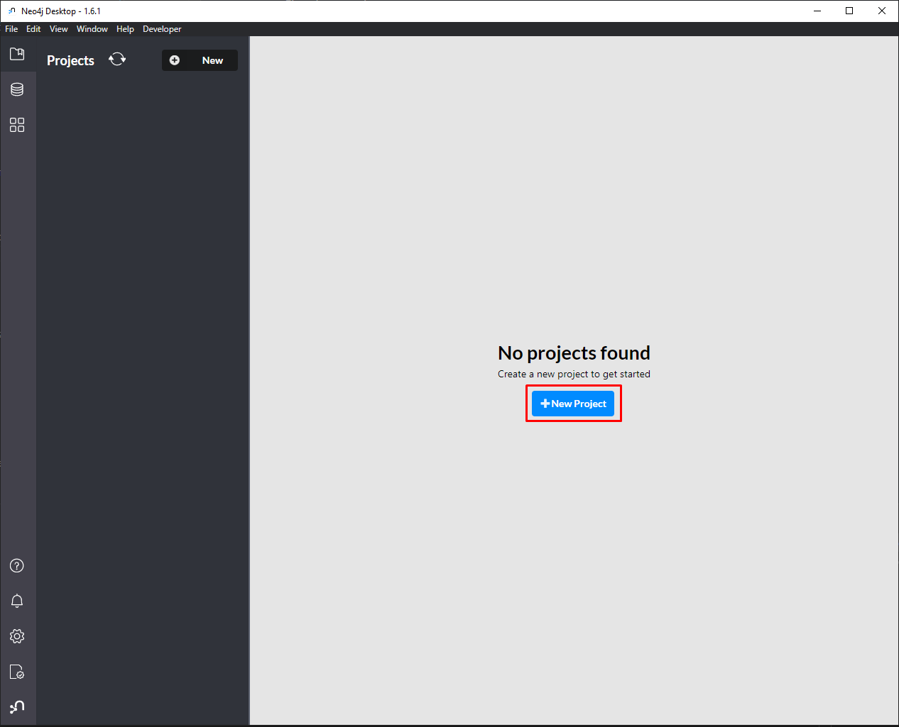
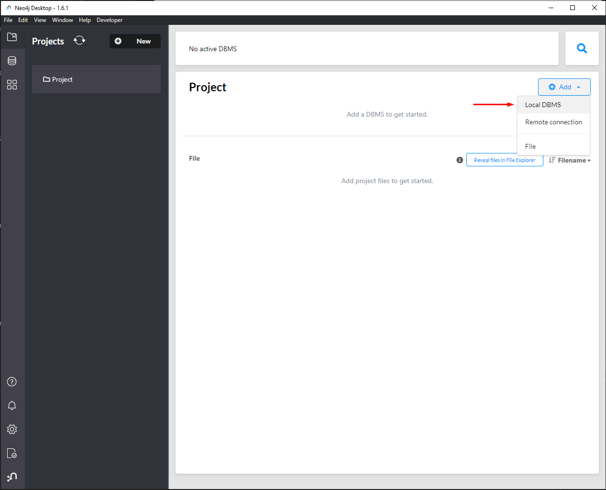
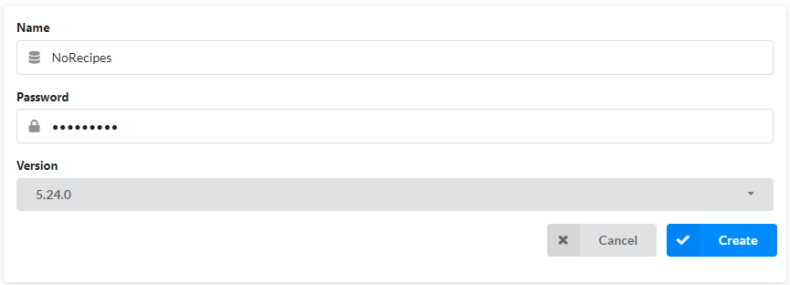
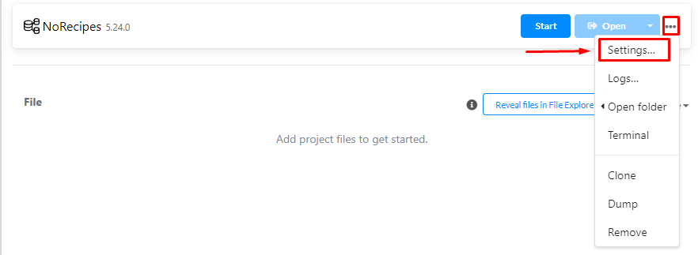
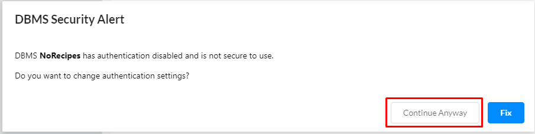
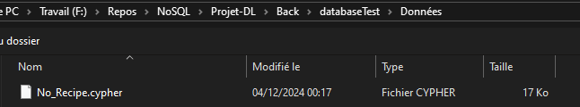
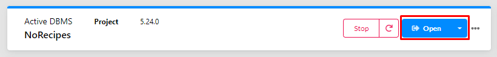
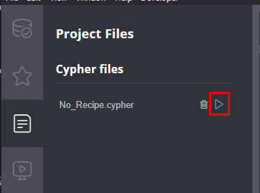
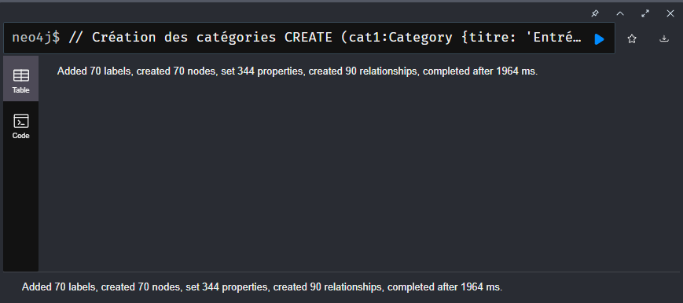

# Projet Warehousing, Data Lakes, Polystores

Projet réalisé dans le cadre de la 2ème année du Master DS4SC à Blois.

Réalisé par : 
- Therno Amadou DIALLO
- Maxime EMONNOT
- Maimouna TIMERA

## Table des matières

- [Objectif du projet](#objectif-du-projet)
- [Choix technologiques](#choix-technologiques)
- [Structure du projet](#structure-du-projet)
- [Fonctionnalités attendues](#fonctionnalités-attendues)
  * [Ce qui était prévu](#ce-qui-était-prévu)
  * [Ce qui a été réalisé](#ce-qui-a-été-réalisé)
- [Configuration](#configuration)
  * [Initialisation base de données](#initialisation-base-de-données)
  * [Insertion données dans la base de données](#insertion-données-dans-la-base-de-données)
    + [Insertion via l'interface graphique de Neo4j Desktop](#insertion-via-linterface-graphique-de-neo4j-desktop)
    + [Insertion via terminal](#insertion-via-terminal)
  * [Initialisation Back-end](#initialisation-back-end)
  * [Initialisation Front-end](#initialisation-front-end)
- [Exécution](#exécution)

## Objectif du projet

L'objectif de ce projet est de concevoir une application web permettant d'accéder à différentes recettes, et d'ajouter ces recettes à la volée, à la manière d'un site tel que Marmiton.

Additionnellement, cette application doit permettre la gestion de données interconnectées dans le cadre des recettes de cuisine, notamment avec des recettes pouvant avoir des ingrédients en commun. 

Notre objectif sera donc de permettre à l'utilisateur de rechercher des recettes selon une liste d'ingrédients, de lui proposer une liste de recettes suggérées à partir de la recette qu'il est en train de visionner.

Ce projet permettra donc ainsi de prendre en main les différentes technologies que nous avons sélectionnées, que ce soit pour le back-end, front-end et notre base de données en graphes.

## Choix technologiques

| Back-end | Front-end | Base de données |
|----------|-----------|-----------------|
| Django   | React     | Neo4J           |

## Structure du projet

Le dépôt suit la structure suivante : 

```
🗂️ NoRecipes
|
+-- 📂 Back
|   +-- 📂 NoRecipes
|   |   +-- 🐍 __init__.py
|   |   +-- 🐍 asgi.py
|   |   +-- 🐍 settings.py
|   |   +-- 🐍 urls.py
|   |   +-- 🐍 wsgi.py
|   |   
|   +-- 📂 databaseTest
|   |   +-- 📂 Données
|   |   |   +-- 📜 No_Recipe.cypher
|   |   |
|   |   +-- 📂 migrations
|   |   |   +-- 🐍 __init__.py
|   |   |
|   |   +-- 📂 views
|   |   |   +-- 🐍 category.py
|   |   |   +-- 🐍 comments.py
|   |   |   +-- 🐍 connector_recipe_category.py
|   |   |   +-- 🐍 connector_recipe_ingredient.py
|   |   |   +-- 🐍 connector_recipe_utensil.py
|   |   |   +-- 🐍 ingredient.py
|   |   |   +-- 🐍 recipe.py
|   |   |   +-- 🐍 utensil.py
|   |   |   +-- 🐍 views_test_maxime.py
|   |   |
|   |   +-- 🐍 __init__.py
|   |   +-- 🐍 admin.py
|   |   +-- 🐍 apps.py
|   |   +-- 🐍 models.py
|   |   +-- 🐍 tests.py
|   |   +-- 🐍 urls.py
|   |
|   +-- 📃 .gitignore
|   +-- 🐍 manage.py
|   +-- 📜 requirements.txt
|   +-- 🐍 utils.py
|
+-- 📚 Docs
|   +-- 🖼️ image-0.png
|   +-- 🖼️ image-1.png
|   +-- 🖼️ image-2.png
|   +-- 🖼️ image-3.png
|   +-- 🖼️ image-4.png
|   +-- 🖼️ image-5.png
|   +-- 🖼️ image-6.png
|   +-- 🖼️ image-7.png
|   +-- 🖼️ image-8.png
|   +-- 🖼️ image-9.png
|
+-- 📂 Front
|   +-- 📂 public
|   |   +-- 🖼️ favicon.ico
|   |   +-- 🌐 index.html
|   |   +-- 🖼️ logo192.png
|   |   +-- 🖼️ logo512.png
|   |   +-- 📑 manifest.json
|   |   +-- 📜 robots.txt
|   |
|   +-- 📂 src
|   |   +-- 📂 components
|   |   |   +-- 📂 Catégories
|   |   |   |   +-- 📜 AddCategory.js
|   |   |   |   +-- 📜 CategoryCard.js
|   |   |   |
|   |   |   +-- 📂 Ingredients
|   |   |   |   +-- 📜 AddIngredient.js
|   |   |   |
|   |   |   +-- 📂 recipes
|   |   |   |   +-- 📜 AddRecipe.js
|   |   |   |   +-- 📜 AdvancedSearchRecipes.js
|   |   |   |   +-- 📜 AllRecipes.js
|   |   |   |   +-- 📜 EditRecipe.js
|   |   |   |   +-- 📜 RecipeCard.js
|   |   |   |   +-- 📜 RecipeDetails.js
|   |   |   |   +-- 📜 SimpleSearchRecipes.js
|   |   |   |
|   |   |   +-- 📂 Ustensiles
|   |   |   |   +-- 📜 CategoryCard.js
|   |   |   |   +-- 📜 AddUtensil.js
|   |   |   |
|   |   |   +-- 📜 AdvancedSearch.js
|   |   |   +-- 📜 Footer.js
|   |   |   +-- 📜 Navbar.js
|   |   |
|   |   +-- 📂 images
|   |   |   +-- 🖼️ aperitifs.jpg
|   |   |   +-- 🖼️ banner.jpg
|   |   |   +-- 🖼️ boissons.jpg
|   |   |   +-- 🖼️ breakfast.jpg
|   |   |   +-- 🖼️ dessert.jpg
|   |   |   +-- 🖼️ dinner.jpg
|   |   |   +-- 🖼️ entree.jpg
|   |   |   +-- 🖼️ LogoSite.jpg
|   |   |
|   |   +-- 📂 pages
|   |   |   +-- 📜 HomePage.js
|   |   |
|   |   +-- 📂 styles
|   |   |   +-- 🎨 AddCategory.css
|   |   |   +-- 🎨 AddIngredient.css
|   |   |   +-- 🎨 AddRecipe.css
|   |   |   +-- 🎨 AddUtensil.css
|   |   |   +-- 🎨 AdvancedSearch.css
|   |   |   +-- 🎨 AllRecipes.css
|   |   |   +-- 🎨 CategoryCard.css
|   |   |   +-- 🎨 HomePage.css
|   |   |   +-- 🎨 Navbar.css
|   |   |   +-- 🎨 RecipeCard.css
|   |   |   +-- 🎨 RecipeDetails.css
|   |   |
|   |   +-- 🎨 App.css
|   |   +-- 🧪 App.test.js
|   |   +-- 🎨 index.css
|   |   +-- 📜 index.js
|   |   +-- 🖼️ logo.svg
|   |   +-- 📜 reportWebVitals.js
|   |   +-- 📜 setupTests.js
|   |
|   +-- 📃 .gitignore
|   +-- 📑 package-lock.json
|   +-- 📑 package.json
|   +-- 📃 README.md
|
+-- 📃 .gitignore
+-- 📃 README.md
```

## Fonctionnalités attendues

### Ce qui était prévu

Nous avions prévu les fonctionnalités suivantes :

- Ajout / Modification / Suppression de recettes
- Ajout / Modification / Suppression d’ingrédients
- Ajout / Modification / Suppression de catégories (Modérateur)
- Validation par admin de recettes/ingrédients/catégories
- Recherche simple
- Recherche avancée / filtre : 
  * Par ingrédients
  * Par type de cuisine
  * Par origine
  * Par type de plat (entrée, plat principal, dessert, viennoiserie, pâtisseries…)
  * Par note
  * Par nombre de vues
- Commenter une recette
- Modifier un commentaire (utilisateur inscrit et authentifié qui a commenté)
- Supprimer un commentaire (Modérateur + Admin)
- Donner une note (1 à 5)
- Création utilisateur
  * Inscription classique via formulaire (mail, mot de passe…)
  * Inscription via Google, Discord, Facebook… (Facultatif)
- Système de recommandation : 
  * Nombre de vues
  * Historique utilisateur
  * Meilleure note… 
  * Ingrédients en commun avec la dernière recette vue

### Ce qui a été réalisé

Après prise de recul, nous avons décidé de nous focaliser uniquement sur la preuve de concept de notre application, et notamment la partie relation en graphe des recettes avec les différents ingrédients. Ainsi, nous avons implémenté les fonctionnalités suivantes : 
- Ajout / Modification / Suppression de recettes
- Ajout / Modification / Suppression d’ingrédients
- Ajout / Modification / Suppression de catégories (Modérateur)
- Recherche simple
- Recherche avancée / filtre : 
  * Par nom
  * Par ingrédients
  * Par type de cuisine
  * Par origine
  * Par type de plat (entrée, plat principal, dessert, viennoiserie, pâtisseries…)
  * Par note
- Système de recommandation : 
  * Classé par note
  * Ingrédients en commun avec la recette en cours
  * Type de cuisine en commun avec la recette en cours

## Configuration

Avant exécution de l'application, il est importer de configurer correctement l'environnement.

### Initialisation base de données
Afin d'initialiser notre base de données, il est important de créer un nouveau projet : 


Nous ajoutons ensuite une base de données locale : 


Nous définirons les paramètres suivants pour cette base : 
- **Name** : `NoRecipes`
- **Password** : `123456789` *(cela nous importe peu pour la suite)*



Une fois crée, nous devrons nous rendre dans les paramètres de la base, afin de désactiver l'authentification par mot de passe : 


A présent, nous pouvons défiler vers le bas jusqu'au bloc de code : 
```r
# Whether requests to Neo4j are authenticated.
# To disable authentication, uncomment this line
dbms.security.auth_enabled=true
``` 

Et nous modifirons la valeur de `dbms.security.auth_enabled` à `false`.

Nous pouvons à présent ouvrir la base de données, en confirmant bien que nous souhaitons démarrer la base de données sans authentification : 


### Insertion données dans la base de données

Maintenant que notre base de données est crée et démarrée, nous devons insérer les données initiales de notre système. 

Un fichier Cypher se trouve au chemin suivant : `Back/databaseTest/Données/No_Recipe.cypher`.

Nous pouvons insérer les données des deux manières suivantes : 

#### Insertion via l'interface graphique de Neo4j Desktop

Accédez à l'onglet **File > Add file(s) to Project** : 


Sélectionnez le fichier Cypher au chemin cité précédemment : 


Ouvrons à présent Neo4j Browser : 


Nous pouvons à présent exécuter notre fichier Cypher :  


Insertion terminée ! 


#### Insertion via terminal

Ouvrez un terminal et exécutez les commandes suivantes : 
```shell
cd Back/databaseTest/Données
bin/cypher-shell -u neo4j -f No_Recipe.cypher
```

### Initialisation Back-end
Afin d'initialiser l'environnement Back-end, ouvrez un terminal et entrez les commandes suivantes : 
```shell
cd Back
pip install -r requirements.txt
```

### Initialisation Front-end
Afin d'initialiser l'environnement Front-end, ouvrez un terminal et entrez les commandes suivantes : 
```shell
cd Front
npm install
```

## Exécution

Maintenant que notre environnement est configuré, nous pouvons exécuter notre application.

**Assurez vous dans un premier temps que la base données Neo4J que nous avons configurée précédemment est bien en cours d'exécution.**

Ouvrez un premier terminal pour exécuter le serveur Back-end et entrez les commandes suivantes : 
```shell
cd Back
python manage.py runserver
```

Ouvrez un second terminal pour exécuter le serveur Front-end et entrez les commandes suivantes : 
```shell
cd Front
npm start
```

Vous pouvez à présent utiliser l'application en vous connectant à l'URL : `http://localhost:3000`